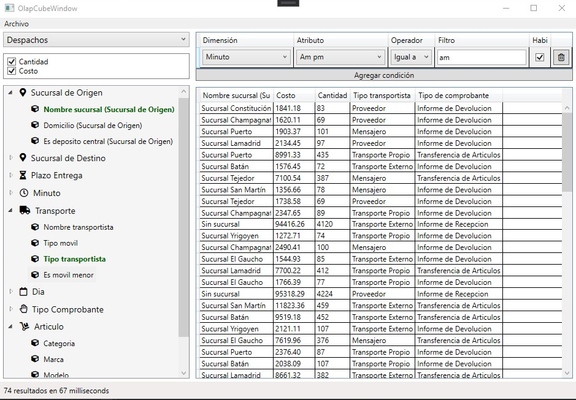
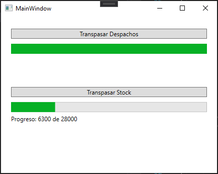

# datamart-fasta
DataMart Fasta

## Instrucciones. 

Crear dos bases de datos en SQL Server: `faverino` y `faverino_datamart`.
Cargar cada base de datos usando los scripts `sql/faverino-completa.sql` y `sql/faverino_datamart.sql` respectivamente.

Editar el archivo `Config.cs` y cambiar el usuario y constraseña de SQL server.

Ejecutar. 

## Interfaz principal

## Interfaz de ETL

Atención, el sistema no está preparado para que se ejecuten multiples ETL al mismo tiempo. Ejecutar una a la vez. 